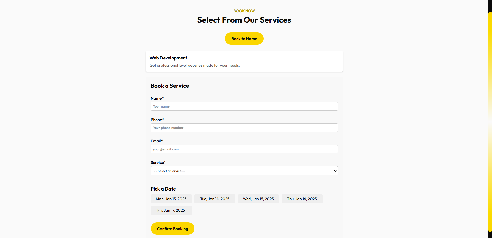

# Quamin Website

A visually rich, full-stack web application offering **IT services, job applications, blog posts, and an admin dashboard** for streamlined management. The platform is designed to showcase how modern front-end and back-end technologies come together to deliver a comprehensive solution.

---

## Overview

**Quamin** is built with aesthetics and functionality in mind. It includes:

-   **Landing Page**: An engaging introduction, highlighting key services.
-   **Service Booking**: A curated set of services, date/time slot selection, and an automatic conflict check.
-   **Job Application**: Potential candidates submit personal/contact info and a resume link.
-   **Blog**: Displays up-to-date posts and detailed views.
-   **About Us**: A hover-based overlay design showing the company’s mission, expertise, and approach.

Meanwhile, the **Admin** experience provides:

-   **Services Management**: Add/update/delete available services.
-   **Bookings Management**: View upcoming and past bookings, update statuses (Pending, Completed, Cancelled).
-   **Job Applications**: Review submitted applications in one place.
-   **Blog Management**: Create, modify, or remove blog posts.
-   **Secure Admin Access**: JWT-protected routes ensure only authorized admins can manage platform data.

---

## Key Features

-   **Responsive Front-End**  
    Built with React and a flexible CSS approach, ensuring it looks great on desktop, tablet, and mobile.

-   **Time-Slot Conflict**  
    Any already-booked date/time slots are hidden from new bookings, preventing overlaps.

-   **Dynamic Hover Cards**  
    The About Us section uses overlays that show additional info when users hover over each card.

-   **Admin Dashboard**  
    A centralized place to handle all data—services, bookings, blogs, and job applications.

-   **JWT-Based Security**  
    Admin routes are protected. Only valid tokens can create/update/delete resources in sensitive areas.

---

## Screenshots

### Service Booking

  
Browse or search available services, choose a date, and book an available time slot.

### Job Application

  
Applicants fill in basic details and upload a resume link to apply for open positions.

### Admin Dashboard

  
Admin users can manage bookings, blog posts, services, and job applications in one interface.

### About Us

  
Hover over each card to reveal detailed mission statements, expertise insights, and approach.

---

## Technology Highlights

-   **Front-End**:

    -   **React (Vite)** for a lightweight yet robust development experience
    -   **CSS** (modules/custom) for styling and responsiveness
    -   **Axios** for seamless HTTP requests

-   **Back-End**:

    -   **Node.js & Express** powering RESTful APIs
    -   **MongoDB (Mongoose)** for a flexible, scalable data layer
    -   **JWT** for user/admin authentication

-   **Design Aesthetics**:
    -   Consistent color palette and hover animations
    -   Minimal but functional UI elements for quick user adoption

---

## Collaborators

- **Saksham Lamba** [GitHub](https://github.com/lamba44)
- **Eshaan Gupta** [GitHub](https://github.com/EshaanGupta1011)
